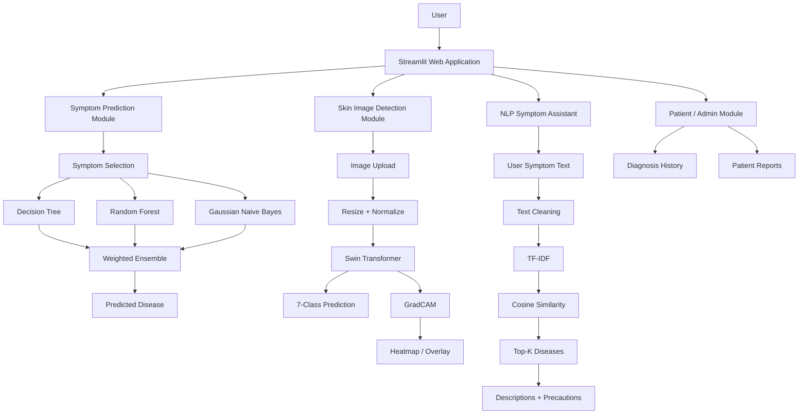
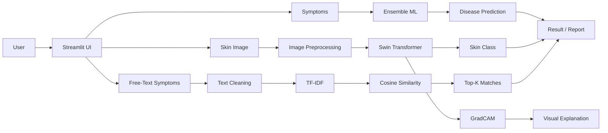
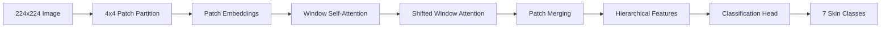
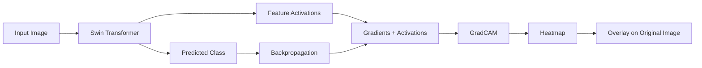
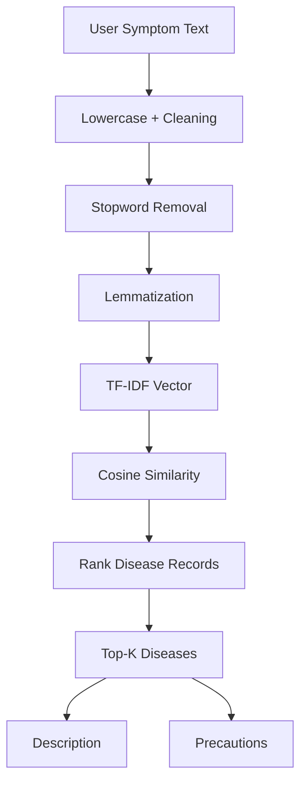
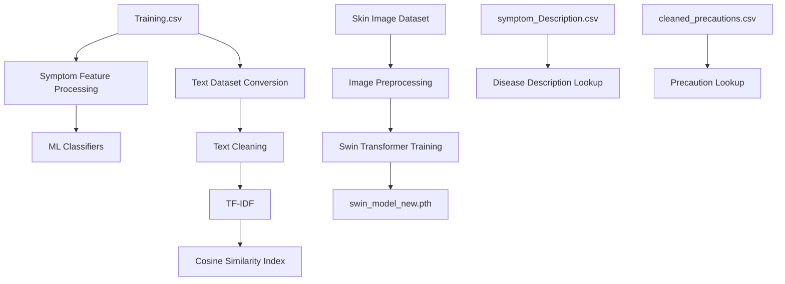
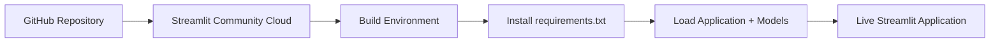

# 🩺 AI-Medico — AI-Based Medical Assistance System

[](https://new-medico-ai-dpgtcms75yv9gqkavimazv.streamlit.app/)
[](https://www.python.org/)
[](https://streamlit.io/)
[](https://pytorch.org/)
[](https://scikit-learn.org/)

> **AI-Medico** is a multi-module healthcare assistance application combining structured symptom-based disease prediction, skin-lesion image classification, explainable AI with GradCAM, and an NLP-based symptom retrieval assistant.

## 🚀 Live Demo

**Try the deployed application:**  
https://new-medico-ai-dpgtcms75yv9gqkavimazv.streamlit.app/

> **Important:** This application is an educational/research prototype and is **not a substitute for professional medical diagnosis or treatment**. Predictions should be reviewed by a qualified healthcare professional.

---

# 📌 Project Overview

AI-Medico combines three AI/ML approaches into one Streamlit application:

1. **Symptom-Based Disease Prediction**
   - Decision Tree
   - Random Forest
   - Gaussian Naive Bayes
   - Weighted ensemble voting

2. **Skin Cancer Image Classification**
   - Swin Transformer (`swin_tiny_patch4_window7_224`)
   - PyTorch + `timm`
   - Seven-class classification in the current model
   - GradCAM visualization for explainability

3. **NLP Symptom Assistant**
   - Text preprocessing
   - TF-IDF vectorization
   - Unigram + bigram features
   - Cosine similarity retrieval
   - Disease descriptions and precautions

The application also includes supporting functionality for patient/diagnosis history and report generation.

---

# 🏗️ High-Level Architecture



---

# 🔄 End-to-End System Flow



---

# 📁 Project Structure

The project is organized around the Streamlit application, trained models, datasets, uploaded images, generated reports, and supporting ML/NLP assets.

```text
AI_medico/
│
├── disease_app/
│   │
│   ├── Home.py
│   │
│   ├── pages/
│   │   ├── Disease Prediction
│   │   ├── Skin Cancer Detection
│   │   ├── Symptom Chatbot
│   │   └── Admin / Reports
│   │
│   ├── models/
│   │   ├── swin_model_new.pth
│   │   ├── unet_model.keras
│   │   └── other trained model files
│   │
│   ├── patient_reports/
│   │   └── Generated patient PDF reports
│   │
│   ├── uploads/
│   │   └── User-uploaded medical images
│   │
│   ├── Training.csv
│   ├── Testing (2).csv
│   ├── cleaned_symptoms_new.csv
│   ├── symptom_Description.csv
│   ├── cleaned_precautions.csv
│   │
│   ├── df_symptoms.pkl
│   ├── vectorizer.pkl
│   ├── X.pkl
│   │
│   └── report_generator.py
│
├── requirements.txt
├── README.md
└── .gitignore
```

> **Note:** The exact filenames/pages can vary between local development and the deployed version. The structure above represents the modules and assets used in the project code.

---

# 🧠 Module 1 — Symptom-Based Disease Prediction

## Input

The user selects up to five symptoms from the Streamlit interface.

Example:

```text
Fever
Cough
Fatigue
Headache
```

Each symptom is represented as a binary feature:

```text
1 = symptom present
0 = symptom absent
```

## Models

Three classifiers are trained:

```text
                 Symptoms
                    │
       ┌────────────┼────────────┐
       ↓            ↓            ↓
 Decision Tree  Random Forest  Naive Bayes
       │            │            │
       └────────────┼────────────┘
                    ↓
             Weighted Voting
                    ↓
             Final Disease
```

### Weighted Ensemble

Each model produces a disease prediction and its test accuracy is used as the voting weight.

Conceptually:

```text
Disease Score =
    DT Weight
  + RF Weight
  + NB Weight
```

The disease with the highest accumulated weight becomes the final prediction.

### Why Ensemble?

Different algorithms learn patterns differently. Combining their predictions can make the final result less dependent on one individual classifier.

---

# 🖼️ Module 2 — Skin Cancer Detection

The image classification module uses a **Swin Transformer Tiny** architecture implemented through the `timm` library.

```python
model = timm.create_model(
    "swin_tiny_patch4_window7_224",
    pretrained=False,
    num_classes=7
)
```

## Current Classes

The current deployed model contains seven classes:

1. Actinic keratosis
2. Basal cell carcinoma
3. Melanoma
4. Nevus
5. Pigmented benign keratosis
6. Squamous cell carcinoma
7. Vascular lesion

> **Resume consistency note:** an earlier version of the project used nine classes. The current model/code uses seven. The README intentionally documents the current seven-class implementation rather than claiming nine classes for the deployed model.

---

# 🔬 How Swin Transformer Works



### Why Swin Transformer?

Unlike a traditional CNN, Swin Transformer uses self-attention to model relationships between image patches.

It uses **local windows** instead of computing attention over the complete image. The windows are shifted between stages so information can move between neighboring regions.

This gives the model:

- Local feature understanding
- Broader contextual information
- Hierarchical feature extraction
- More efficient attention than global Vision Transformer attention

---

# 🧹 Image Preprocessing

Uploaded images are:

```text
Original Image
      ↓
Resize to 224 × 224
      ↓
Convert to Tensor
      ↓
Normalize
      ↓
Swin Transformer
```

Normalization uses:

```python
mean = [0.485, 0.456, 0.406]
std  = [0.229, 0.224, 0.225]
```

---

# 🧠 GradCAM Explainability

The project also generates a GradCAM heatmap.



GradCAM answers:

> **"Which regions of the image influenced the model's prediction?"**

The interface displays:

```text
Original Image | GradCAM Heatmap | Overlay
```

This improves interpretability compared with showing only a class label.

---

# 💬 Module 3 — NLP Symptom Assistant

The chatbot is a **retrieval-based NLP system**, not an LLM-based generative chatbot.

## Pipeline



## TF-IDF

TF-IDF converts symptom text into numerical vectors.

The implementation also uses:

```python
TfidfVectorizer(ngram_range=(1,2))
```

This captures:

- Unigrams: `fever`, `cough`, `fatigue`
- Bigrams: `chest pain`, `skin rash`

## Cosine Similarity

The user's symptom vector is compared with symptom vectors in the dataset.

```text
User Vector
     │
     ├──── Disease Vector 1 → 0.91
     ├──── Disease Vector 2 → 0.76
     ├──── Disease Vector 3 → 0.63
     └──── Disease Vector 4 → 0.12
```

The highest-scoring diseases are returned.

---

# 📊 Data & Model Flow



---

# 📄 Patient Reports

The application includes patient/diagnosis report generation.

The report workflow is conceptually:

```text
User Input
    ↓
Prediction
    ↓
Disease + Symptoms
    ↓
Patient Information
    ↓
Report Generator
    ↓
PDF Report
    ↓
patient_reports/
```

PDF generation is handled using the project's report generation module.

---

# 🖥️ Technology Stack

| Area | Technology |
|---|---|
| Frontend / UI | Streamlit |
| Language | Python |
| Classical ML | Scikit-learn |
| Disease Models | Decision Tree, Random Forest, Gaussian Naive Bayes |
| Deep Learning | PyTorch |
| Vision Architecture | Swin Transformer |
| Model Library | `timm` |
| Explainable AI | GradCAM |
| Image Processing | OpenCV, Pillow |
| NLP | TF-IDF, NLTK |
| Similarity Search | Cosine Similarity |
| Data Processing | Pandas, NumPy |
| Visualization | Matplotlib |
| Reports | ReportLab |
| Deployment | Streamlit Community Cloud |

---

# ⚙️ Installation

## 1. Clone the repository

```bash
git clone <YOUR_GITHUB_REPOSITORY_URL>
cd AI_medico
```

## 2. Create a virtual environment

### Windows

```bash
python -m venv venv
venv\Scripts\activate
```

### Linux / macOS

```bash
python3 -m venv venv
source venv/bin/activate
```

## 3. Install dependencies

```bash
pip install -r requirements.txt
```

## 4. Run locally

```bash
streamlit run disease_app/Home.py
```

The application will normally open at:

```text
http://localhost:8501
```

---

# ☁️ Deployment

The application is deployed using **Streamlit Community Cloud**.

Deployment flow:



### Live Application

https://new-medico-ai-dpgtcms75yv9gqkavimazv.streamlit.app/

---

# 📈 Evaluation

## Disease Prediction

The classical ML component evaluates:

- Decision Tree accuracy
- Random Forest accuracy
- Gaussian Naive Bayes accuracy

The ensemble uses model performance as weights for the final vote.

## Skin Cancer Classification

The project has experimented with different class configurations and model versions.

**Current deployed model:** 7 classes.

If reporting performance on a resume, make sure the reported accuracy corresponds to the exact model version and class count being discussed.

---

# 🔐 Data & Safety Considerations

This project is an educational/research prototype.

It should **not** be used as a standalone clinical diagnostic system.

Important limitations:

- Model predictions can be incorrect.
- Image quality can affect classification.
- Dataset bias can affect generalization.
- Similar symptoms can correspond to different diseases.
- Confidence scores should not be interpreted as medical certainty.
- A qualified healthcare professional should make clinical decisions.

---

# ⚠️ Current Technical Limitations

### 1. NLP semantic understanding

The chatbot primarily relies on TF-IDF similarity. It may struggle with symptoms expressed using wording that is very different from the indexed dataset.

**Potential improvement:** Sentence-BERT / transformer embeddings.

### 2. Dataset limitations

Performance depends heavily on the quality, balance, and diversity of the training data.

### 3. CPU inference

The deployed Streamlit environment may perform deep-learning inference on CPU, which can increase prediction latency.

### 4. Medical validation

The system is not clinically validated and should not be represented as a medical diagnostic device.

### 5. Model version consistency

Different experiments used different numbers of skin-cancer classes. Model files, class labels, metrics, and resume claims should always refer to the same trained checkpoint.

---

# 🔮 Future Improvements

- Replace TF-IDF retrieval with Sentence-BERT embeddings.
- Add a vector database for scalable symptom retrieval.
- Fine-tune the vision model on a larger and more diverse dermatology dataset.
- Add model calibration for more meaningful confidence estimates.
- Add authentication and role-based access.
- Use a production database instead of local files.
- Add automated testing and CI/CD.
- Containerize the application using Docker.
- Add structured audit logs.
- Add multilingual symptom input.
- Add human-in-the-loop review for high-risk predictions.
- Improve model monitoring and drift detection.

---

# 🎯 Interview Explanation

A concise way to explain the project:

> **AI-Medico is a multi-modal healthcare assistance application that combines classical machine learning, computer vision, and NLP. For structured symptoms, I use Decision Tree, Random Forest, and Gaussian Naive Bayes models with weighted ensemble voting. For skin lesion images, I fine-tuned a Swin Transformer and integrated GradCAM to provide visual explanations for predictions. I also built an NLP-based symptom assistant that converts user text into TF-IDF vectors and uses cosine similarity to retrieve the most relevant diseases and precautions. The complete application is integrated through Streamlit and deployed on Streamlit Community Cloud.**

---

# 🧩 Key Interview Concepts

Be prepared to explain:

### Machine Learning
- Decision Tree
- Random Forest
- Gaussian Naive Bayes
- Ensemble learning
- Weighted voting
- Accuracy
- Train/test split

### Computer Vision
- Image preprocessing
- Transfer learning / fine-tuning
- Swin Transformer
- Patch embedding
- Window attention
- Shifted window attention
- Softmax
- GradCAM

### NLP
- Text preprocessing
- Stopword removal
- Lemmatization
- TF-IDF
- Unigrams and bigrams
- Cosine similarity
- Top-K retrieval

### Deployment
- Streamlit
- Requirements management
- Model loading
- Caching
- Streamlit Community Cloud

---

# 📚 Research / Academic Work

The project was also developed as an academic/research-oriented healthcare AI application.

When presenting the research component, distinguish clearly between:

- **Project implementation**
- **Experimental results**
- **Research manuscript**
- **Publication status**

Do not describe a paper as "published" unless it has actually been accepted/published.

---

# 👨‍💻 Author

**Yash Shinde**

AI/ML • Python • Streamlit • Computer Vision • NLP

---

# ⭐ Project Highlights

```text
✓ Multi-module healthcare AI system
✓ Classical ML ensemble
✓ Swin Transformer image classifier
✓ GradCAM explainability
✓ NLP symptom retrieval
✓ TF-IDF + cosine similarity
✓ Disease descriptions & precautions
✓ Patient/report workflow
✓ Streamlit web application
✓ Live cloud deployment
```

---

## ⚕️ Disclaimer

**AI-Medico is intended for educational and research purposes only. It does not provide professional medical diagnosis, treatment, or medical advice. Always consult a qualified healthcare professional for medical decisions.**
